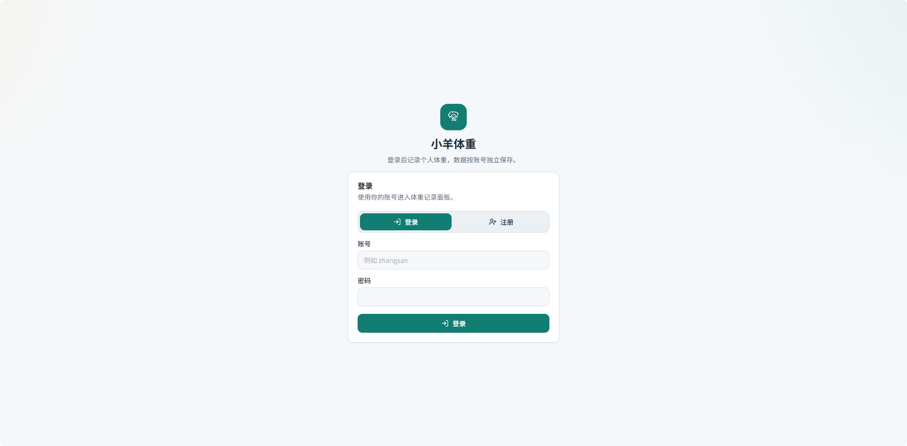
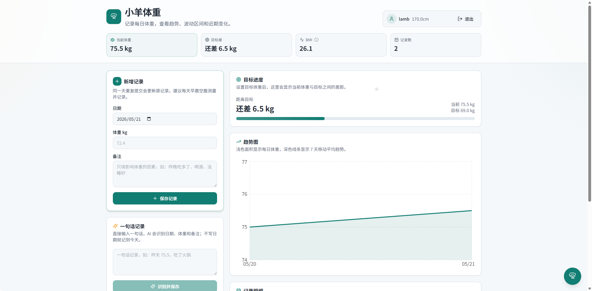
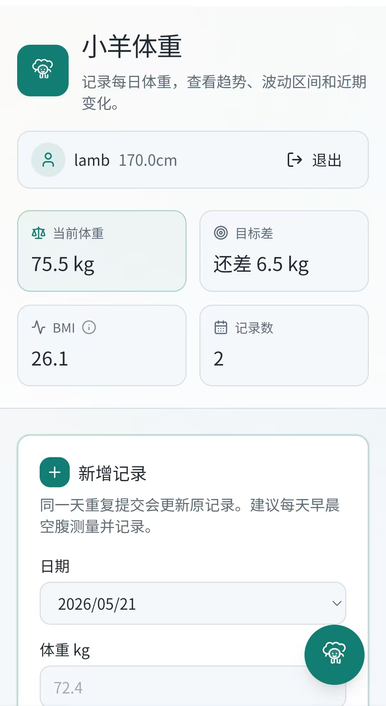

# 小羊体重

一个基于 Next.js、shadcn/ui 风格组件和 PostgreSQL 的体重记录可视化网站，内置账号密码登录注册、用户资料修改，按用户隔离体重数据。

在线体验：<https://weight.thelambday.me>

## 界面预览

**登录 / 注册**



**首页面板（含录入、目标进度与趋势图）**



**移动端布局**

<p align="center">
  
</p>

## 本地运行

```bash
npm install
npm run dev
```

访问 http://127.0.0.1:3000。

## 数据库环境变量

项目默认连接数据库名 `weight`，会自动创建 `users`、`user_sessions`、`weight_entries` 数据表，并维护账号、身高、会话和体重记录字段；数据库本身需要先存在。

```bash
PGHOST=your-postgres-host
PG_PASSWORD=your-postgres-password
PGDATABASE=weight
PGUSER=postgres
PGPORT=5432
```

如果部署到 Vercel 并使用需要 SSL 的 PostgreSQL 服务，添加：

```bash
PGSSLMODE=require
```

## 连接池与 Serverless 部署

应用使用原生 `pg` 连接池，并在进程内复用单例，长驻 Node 进程（如自建服务器、容器）下默认配置即可。

如果把 Next.js 部署到 Serverless（如 Vercel），大量函数实例会各自直连数据库，容易撑爆自建 PostgreSQL 的 `max_connections`。此时建议：

1. 在数据库所在服务器（例如自建的阿里云 PostgreSQL）前置 **pgBouncer**，使用 transaction pooling 模式。
2. 把 `PGHOST` / `PGPORT` 指向 pgBouncer 的监听端口，而不是直连 PostgreSQL。
3. 按需调小每个实例的连接上限：

```bash
PG_POOL_MAX=3
```

## 部署到 Vercel

1. 将代码推送到 GitHub。
2. 在 Vercel 导入仓库。
3. 在 Vercel Project Settings 的 Environment Variables 中配置 `PGHOST`、`PG_PASSWORD`、`SILICONFLOW_API_KEY`，以及需要时的 `PGUSER`、`PGDATABASE`、`PGPORT`、`PGSSLMODE`。
4. 使用默认构建命令 `npm run build`。

## AI 接入

项目已封装 SiliconFlow Chat Completions，默认模型：

```text
deepseek-ai/DeepSeek-V3.2
```

后端接口：

```text
POST /api/ai/chat
```

该接口需要登录后访问，API Key 只在服务端读取：

```text
SILICONFLOW_API_KEY=your-api-key
```

通用聊天接口会自动把最近 10 次体重记录和用户资料放入上下文，便于回答“最近是不是平台期了”这类问题。

AI 复盘接口：

```text
POST /api/ai/report
```

请求体：

```json
{
  "days": 7
}
```

`days` 支持 `7` 或 `30`，分别生成周报和月报。

## 一句话记录

登录后可以直接用一句话保存体重，例如：

```text
今天早上 72.4，跑步后测的
昨天 72.8
5月20号 73kg，晚饭后
```

后端接口：

```text
POST /api/weights/natural
```

该接口会调用 SiliconFlow 解析日期、体重和备注，解析成功后直接写入当前登录用户的数据。

## CSV 导入导出

登录后可以导出当前账号的全部体重记录：

```text
GET /api/weights/export
```

下载文件名：

```text
my_weight_data.csv
```

标准模板：

```csv
date,weight_kg,note
2026-05-21,72.4,跑步后
```

导入接口：

```text
POST /api/weights/import
```

导入时同一天记录会按日期更新，方便迁移历史数据。

## PWA 与趋势

项目已配置 PWA：

```text
/manifest.json
/sw.js
```

移动端浏览器可以添加到主屏幕，以独立应用方式打开。

趋势图包含两条信息：

- 每日体重记录
- 7 天移动平均线，用于过滤日常水分波动

用户资料支持设置目标体重，首页会显示目标差值和进度条。
